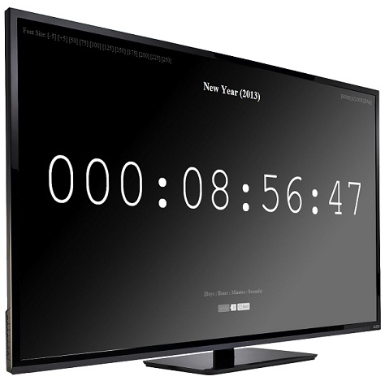

# The New Year Clock

This is a countdown project I made about 10 years ago. I uploaded it to GitHub 3 years ago to archive the old project ([see version 1.0](https://github.com/benhovinga/newyear/tree/1.0)). Just recently I started to do Web Development again and thought I would look over this project and update it to more modern standards while still keeping it simple.

You can preview it at: https://benhovinga.github.io/newyear/

## FAQ

### What is The New Year Clock?
The New Year Clock is a countdown clock to the new year created using JavaScript. It is intended to be viewed on a big screen or projector so everyone at your party can countdown together.

### Is the time accurate?
The time displayed uses your computers clock to judge the time left until new year. If your computers clock is not set to the correct time then the countdown will be off. Set your computers clock to the correct time before using this program.

### How do I use it?
Its as easy as clicking SHOW THE CLOCK on the home page, adjusting the font size, and making your browser display in full screen.

### How do I change the font size?
In the top left corner there are some preset sizes as well as increment adjustments. Select the largest size while still keeping the font on the screen. Using the increment adjustments you can increas or decreas the font in incriments of 5.

### How do I make my browser display full screen?
Each browser is slightly different. Most browsers you can press F11 to enter and exit full screen browsing. Some require you to go to your options menu. Best way to find out is google "[YOUR BROWSER HERE] fullscreen".
